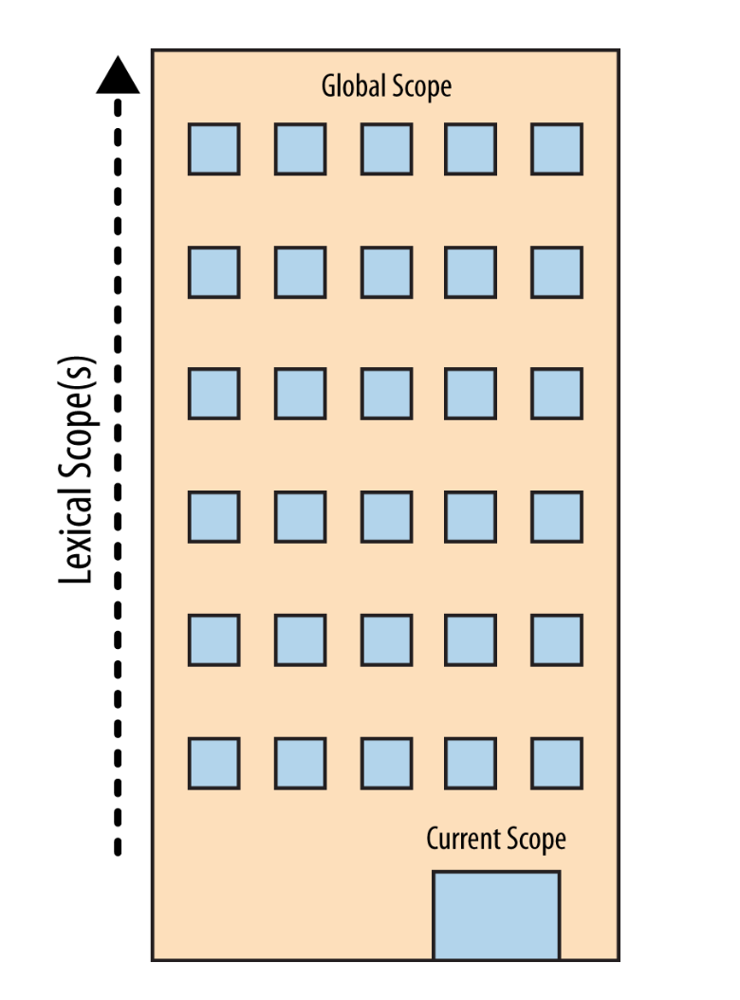

# CLOSURES
* https://www.freecodecamp.org/news/lets-learn-javascript-closures-66feb44f6a44/
> Closures are functions that refer to independent (free) variables .(variables that are neither locally declared nor passed as parameter.)
> In other words, the function defined in the closure ‘remembers’ the environment in which it was created.

***  I don't know JS (SCOPE & CLOSURES)
#  1. WHAT IS THE SCOPE
> SCOPE is set of rules for storing variables in some location, 
> and for finding those variables at a later time.
## Compiler Theory
JavaScript engine performs many of the same steps, 
albeit in more sophisticated ways than we may commonly be aware, 
of any traditional language compiler:

* Tokenizing/Lexing
  >  Breaking up a string of characters 
  >  into meaningful (to the lan‐ guage) chunks, called tokens.
* Parsing
  > taking a stream (array) of tokens and turning it into a tree of nested elements, which collectively represent the grammatical structure of the program. This tree is called an “AST” (abstract syntax tree).
    The tree for var a = 2; might start with a
            > top-level node called VariableDeclaration,  with a 
            >child node called Identifier (whose value is a), and another 
            >child called AssignmentExpres sion, which itself has a child called NumericLiteral (whose value is 2).
* Code-Generation
  > The process of taking an AST and turning it into executable code.

## Understanding Scope
### The Cast

#### Engine
> Responsible for start-to-finish compilation and execution of our JavaScript program.
#### Compiler
> handles all the dirty work of parsing and code-generation.
#### Scope
> collects and maintains a look-up list of all the declared identifiers (variables), 
>and enforces a strict set of rules as to how these are accessible to currently executing code.

Two distinct actions are taken for a variable assignment: 
First, Compiler declares a variable (if not previously declared) in the current Scope, and
second, when executing, Engine looks up the vari‐ able in Scope and assigns to it, if found.

> Closure is when a function is able to remember and access its lexical scope 
>even when that function is executing outside its lexical scope.

### Nested Scope

> Scope is a set of rules for looking up variables by their identifier name. There’s usually more than one scope to consider, however.
> Just as a block or function is nested inside another block or function, scopes are nested inside other scopes. So, if a variable cannot be found in the immediate scope, Engine consults the next outercontaining
> scope, continuing until is found or until the outermost (a.k.a., global) scope has been reached.

### Errors

> ReferenceError is scope resolution-failure related, whereas 
> TypeEr ror implies that scope resolution was successful, 
>but that there was an illegal/impossible action attempted against the result.

 

# 2.Lexical Scope 
